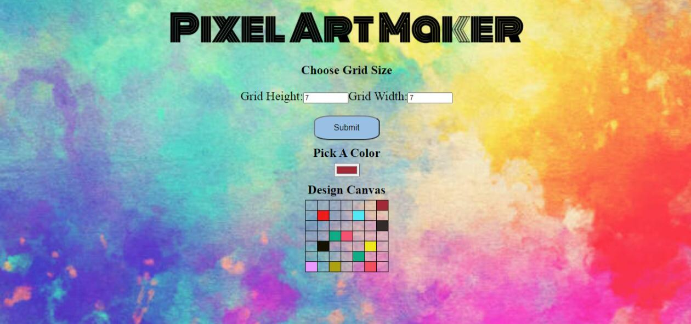

# **Pixel Art Maker Project**
This is a simple pixel art maker project developed using JQuery.

## Table of contents
  - [How to Run](#how-to-run)
  - [What the project does](#what-the-project-does)
  - [Copyright and License](#copyright-and-license)
  - [Result](#result)

## How to Run
1. Download the Project.
2. Extract the folder.
3. Open the (index.html) in the browser.

## What the project does
1. User can enter any number of rows and cols to build his own grid then click **submit** button to see the result grid.
2. User can select any color using the **ColorPicker**.
3. The selected color can be easily applied by *clicking a cell once* after choosing the color from ColorPicker.
4. Colors can be overwritten by changing the selected color from ColorPicker and click the same cell again.
5. Cell can be easily clear if the user *double click* on the cell.

## Result

## Copyright and License
- supplied without rights information contributed by [Udacity](http://www.udacity.com).